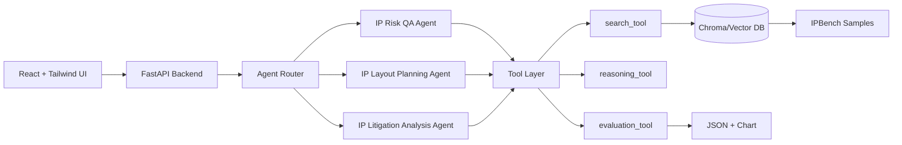

# System Architecture

```mermaid
flowchart LR
  UI[React + Tailwind UI] --> API[FastAPI Backend]
  API --> Router[Agent Router]
  Router --> A1[IP Risk QA Agent]
  Router --> A2[IP Layout Planning Agent]
  Router --> A3[IP Litigation Analysis Agent]
  A1 --> Tools[Tool Layer]
  A2 --> Tools
  A3 --> Tools
  Tools --> Search[search_tool]
  Tools --> Reason[reasoning_tool]
  Tools --> Eval[evaluation_tool]
  Search --> VDB[(Chroma/Vector DB)]
  VDB --> Data[IPBench Samples]
  Eval --> Metrics[JSON + Chart]
```
