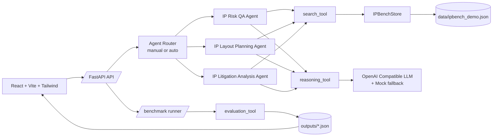
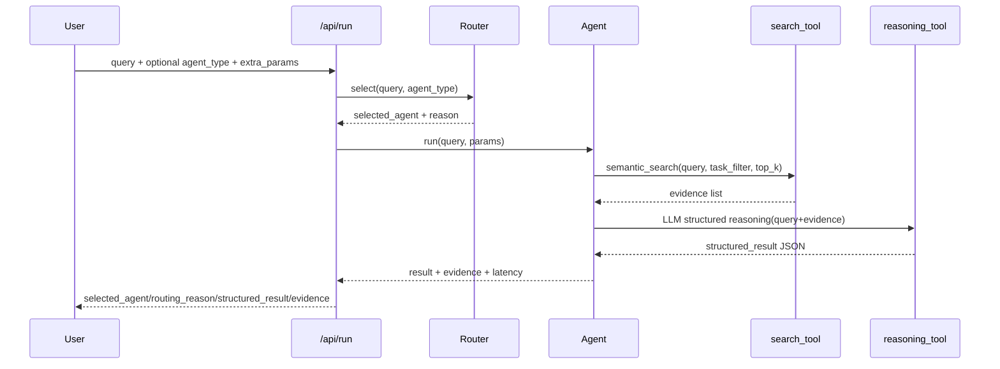
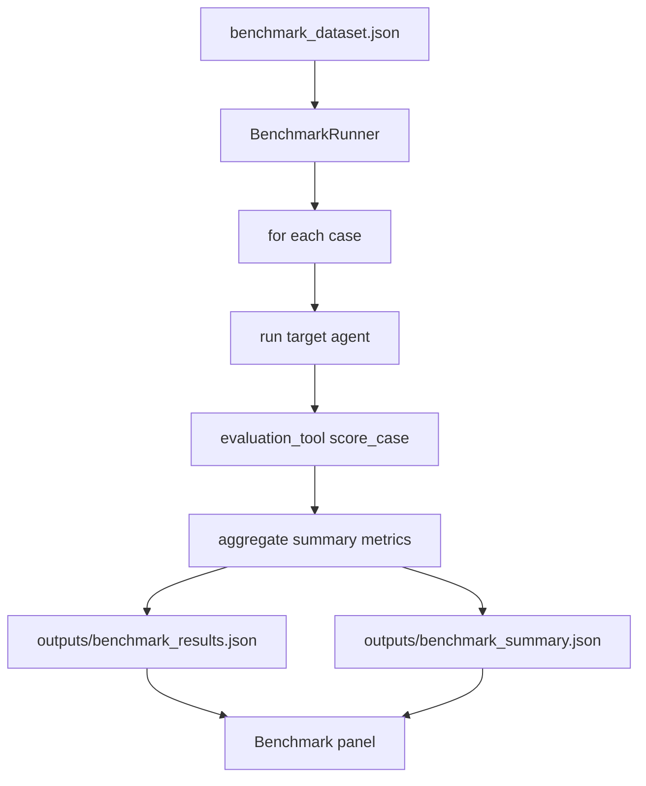

# Architecture: IP Overseas Risk Multi-Agent Demo

## 1) System Overview

该系统由前端 UI、FastAPI 编排层、Agent 层、Tool 层、检索数据层与评估层组成。

```mermaid
flowchart LR
  UI[React + Vite + Tailwind] --> API[/FastAPI API/]
  API --> Router[Agent Router\nmanual or auto]
  Router --> QA[IP Risk QA Agent]
  Router --> LP[IP Layout Planning Agent]
  Router --> LT[IP Litigation Analysis Agent]

  QA --> Search[search_tool]
  LP --> Search
  LT --> Search

  QA --> Reason[reasoning_tool]
  LP --> Reason
  LT --> Reason

  Search --> Store[IPBenchStore]
  Store --> Data[(data/ipbench_demo.json)]
  Reason --> LLM[OpenAI Compatible LLM\n+ Mock fallback]

  API --> Bench[/benchmark runner/]
  Bench --> Eval[evaluation_tool]
  Eval --> Out[(outputs/*.json)]
  Out --> UI
```

## 2) Agent Workflow

```mermaid
sequenceDiagram
  participant U as User
  participant API as /api/run
  participant R as Router
  participant A as Agent
  participant S as search_tool
  participant G as reasoning_tool

  U->>API: query + optional agent_type + extra_params
  API->>R: select(query, agent_type)
  R-->>API: selected_agent + reason
  API->>A: run(query, params)
  A->>S: semantic_search(query, task_filter, top_k)
  S-->>A: evidence list
  A->>G: LLM structured reasoning(query+evidence)
  G-->>A: structured_result JSON
  A-->>API: result + evidence + latency
  API-->>U: selected_agent/routing_reason/structured_result/evidence
```

## 3) Benchmark Workflow

```mermaid
flowchart TD
  D[benchmark_dataset.json] --> B[BenchmarkRunner]
  B --> C1[for each case]
  C1 --> C2[run target agent]
  C2 --> C3[evaluation_tool score_case]
  C3 --> C4[aggregate summary metrics]
  C4 --> O1[outputs/benchmark_results.json]
  C4 --> O2[outputs/benchmark_summary.json]
  O1 --> UI[Benchmark panel]
  O2 --> UI
```
