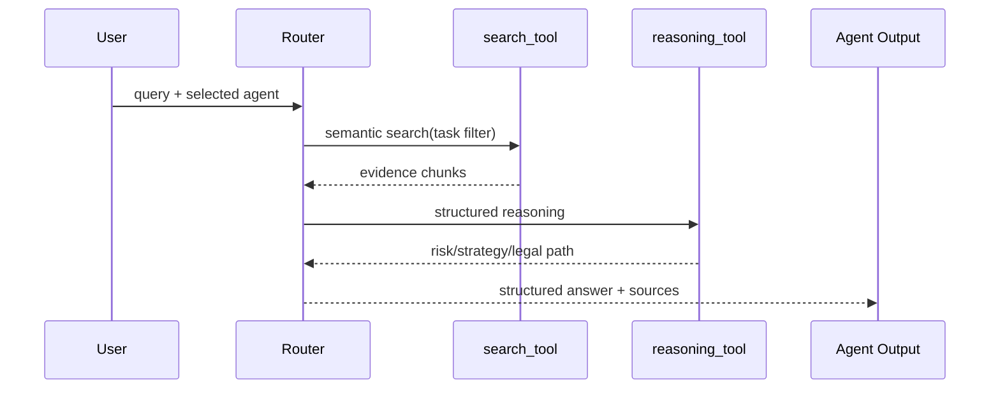

# Agent Workflow

```mermaid
sequenceDiagram
  participant U as User
  participant R as Router
  participant S as search_tool
  participant G as reasoning_tool
  participant A as Agent Output
  U->>R: query + selected agent
  R->>S: semantic search(task filter)
  S-->>R: evidence chunks
  R->>G: structured reasoning
  G-->>R: risk/strategy/legal path
  R-->>A: structured answer + sources
```
